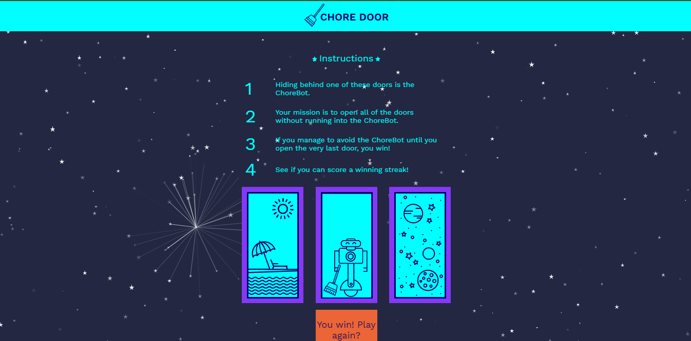

# Chore Door

A simple JavaScript Game.

**Instructions**
1. Hiding behind one of these doors is the ChoreBot.
2. Your mission is to open all of the doors without running into the ChoreBot.
3. If you manage to avoid the ChoreBot until you open the very last door, you win!
4. See if you can score a winning streak!

## Credits
Thanks to 
  - [Codecademy](https://www.codecademy.com/) for awesome tutorials.
  - [Shouvit Pradhan](https://github.com/shaw8wit) for introducing Codecademy to me.
 
## Attributions
 - [ParticleJS library](https://vincentgarreau.com/particles.js/)